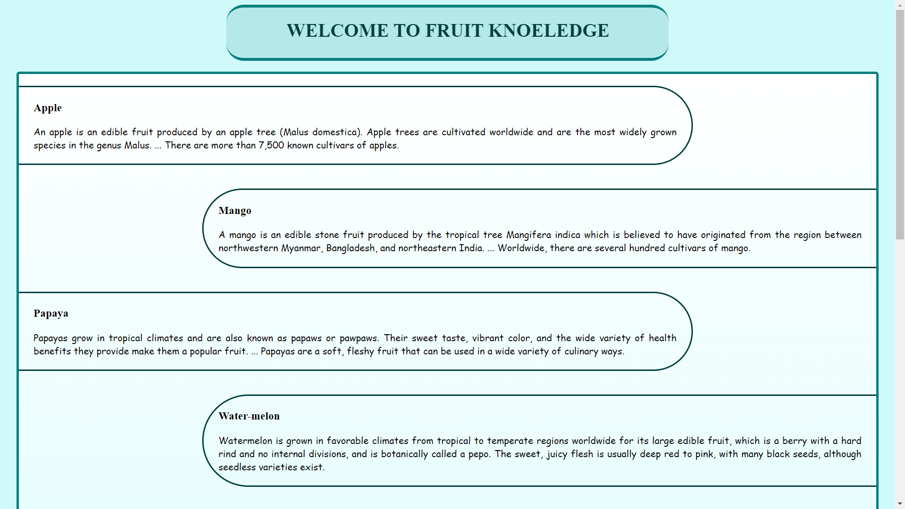

# Fruit Knowledge

## Overview

Welcome to my Fruit Knowledge project! This page, named `index.html`, combines HTML and CSS to showcase information about various fruits. It demonstrates the use of styling elements to enhance the visual appeal of the content.

## Project Structure

- **HTML File:** [`index.html`](index.html)
- **CSS File:** [`style.css`](style.css)
- **View Live:** [`Fruit Knowledge`](https://rahulp-here.github.io/my-web-dev-evolution.github.io/Project-3/index.html)
- **Description:** A webpage providing information about different fruits, styled using HTML and CSS.
- **Languages:** HTML, CSS

## Contents

1. **Title Marquee**
   - Features a scrolling marquee with the title "WELCOME TO FRUIT KNOWLEDGE."

2. **Fruit Information Sections**
   - Divides the page into sections, each dedicated to a different fruit, including Apple, Mango, Papaya, Watermelon, Grapes, Banana, Pineapple, and Strawberry.

3. **Styling with CSS**
   - Applies styling to create visually appealing sections with rounded borders, background color gradients, and distinctive borders for left and right alignment.

4. **Footer**
   - Includes a footer with a gratitude message and a copyright notice.

## Output Screenshots

1. **Fruit Knowledge Page**
   

<!-- Add more screenshots for specific sections as needed -->

## How to Use

1. Clone the repository: `git clone https://github.com/RahulP-Here/my-web-dev-evolution.git`
2. Open [`index.html`](index.html) in a web browser to explore the Fruit Knowledge page.

Feel free to use this project as a template or reference for creating visually appealing web pages using HTML and CSS.

---

&copy; OnlyHTMLCSS2024
